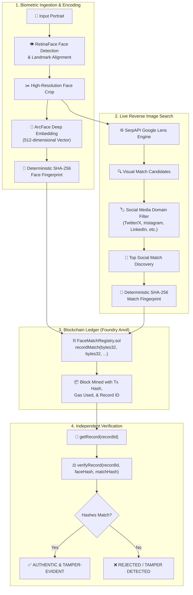

# Face ID + Blockchain Verification Pipeline

[](https://www.python.org/)
[](https://github.com/serengil/deepface)
[](https://github.com/foundry-rs/foundry)
[](https://typer.tiangolo.com/)
[](LICENSE)

An end-to-end provenance and identity pipeline that detects and encodes a face from a photo, discovers matching social media posts via genuine reverse-image search, and writes the match to a blockchain as an immutable, tamper-evident record.

---

## Architecture Overview



---

## Key Features

1. **RetinaFace Detection & Alignment**: Multi-task face detector that isolates face bounding boxes and facial landmarks (eyes, nose, mouth corners) even under angled poses.
2. **ArcFace 512-D Biometric Embeddings**: Employs Additive Angular Margin Loss (`ArcFace`) to generate highly discriminative, unit-normalized 512-dimensional facial representations.
3. **Genuine Reverse Image Search**: Queries Google Lens via SerpAPI with the cropped face image, extracting real URLs, titles, and sources while prioritizing authentic social media platforms.
4. **Foundry Anvil Blockchain**: Deploys the `FaceMatchRegistry.sol` Solidity smart contract to a local Ethereum node (`http://127.0.0.1:8545`) with instant block mining and zero transaction friction.
5. **Cryptographic Tamper-Evidence**: Both biometric vector data and social post metadata are fingerprinted using deterministic SHA-256 and verified on-chain via smart contract view functions.
6. **Modern Typer + Rich CLI**: Formatted terminal output with styled tables, progress spinners, detailed logs, and optional JSON export.

---

## Project Structure

```
Task3 HHG/
├── contracts/
│   └── FaceMatchRegistry.sol     # Solidity 0.8.20 tamper-evident registry
├── src/
│   ├── __init__.py
│   ├── face_engine.py            # RetinaFace detector + ArcFace 512-d embedder
│   ├── search_engine.py          # SerpAPI Google Lens reverse image search
│   ├── blockchain_engine.py      # Foundry Anvil Web3 connector & contract client
│   ├── contract_artifact.json    # Precompiled ABI and EVM Bytecode
│   └── utils.py                  # Cryptographic hashing, platform detector, cropper
├── tests/
│   └── test_pipeline.py          # Automated pytest test suite (5/5 passing)
├── samples/
│   ├── test_face.jpg             # High-quality sample portrait
│   └── lena.jpg                  # Classic benchmark image
├── pipeline.py                   # Main Typer CLI: end-to-end execution
├── verify.py                     # Standalone Typer CLI: on-chain verification
├── foundry.toml                  # Foundry project configuration
├── requirements.txt              # Python dependencies
├── .env.example                  # Environment variables template
├── .gitignore
└── README.md                     # Documentation
```

---

## Prerequisites

1. **Python 3.10+** (tested and verified on Python 3.13)
2. **Foundry (`anvil` & `forge`)**
   - **Windows:** Download prebuilt binary from [Foundry GitHub Releases](https://github.com/foundry-rs/foundry/releases) to `~/.foundry/bin/` or install via Git Bash:
     ```bash
     curl -L https://foundry.paradigm.xyz | bash
     foundryup
     ```
   - **Linux / macOS:**
     ```bash
     curl -L https://foundry.paradigm.xyz | bash
     foundryup
     ```
3. **SerpAPI Key (Optional for live search, free tier available)**:
   - Create a free account at [serpapi.com](https://serpapi.com) (100 free searches/month).
   - Add your key to `.env` or use `--demo-search` for offline demonstration mode.

---

## Installation

1. **Clone the repository**:
   ```bash
   git clone https://github.com/<your-username>/face-blockchain-pipeline.git
   cd face-blockchain-pipeline
   ```

2. **Install Python dependencies**:
   ```bash
   pip install -r requirements.txt
   ```

3. **Configure environment variables**:
   ```bash
   cp .env.example .env
   ```
   Edit `.env` to supply your `SERPAPI_KEY` (optional if using `--demo-search`).

4. **Start Foundry Anvil node** (or let the CLI auto-detect it):
   ```bash
   anvil --port 8545
   ```

---

## Usage

### 1. Run the Full End-to-End Pipeline

Execute the pipeline on an input image:

```bash
python pipeline.py --image samples/test_face.jpg --save-json verification_report.json
```

**Options & Flags:**
```
  -i, --image TEXT             Path to input photo [required]
  -d, --detector TEXT          Face detector (retinaface, opencv, mtcnn) [default: retinaface]
  -m, --model TEXT             Representation model (ArcFace, Facenet512, VGG-Face) [default: ArcFace]
  -k, --serpapi-key TEXT       SerpAPI key for live searches (or set in .env)
  -r, --rpc-url TEXT           Ethereum JSON-RPC URL [default: http://127.0.0.1:8545]
  -c, --contract-address TEXT  Existing contract address (auto-deploys if omitted)
      --demo-search            Use simulated search if no SerpAPI key is available
  -o, --save-json TEXT         Path to export JSON report
```

### 2. Standalone On-Chain Verification

Independently inspect any record on the blockchain and check its tamper-evidence:

```bash
python verify.py --record-id 0
```

### 3. Demonstrate Tamper-Evidence Defense

Run an intentional tamper test to prove the smart contract detects and rejects altered data:

```bash
python verify.py --record-id 0 --tamper-test
```
*Output:*
```
═══ RUNNING SIMULATED TAMPER DEMONSTRATION ═══
Testing altered face hash: 0000000000000000000000000000000000000000000000000000000000000000
Smart contract verifyRecord() returned: False
✅ Tamper defense verified! The blockchain contract successfully rejected the altered face hash.
```

### 4. Run Automated Test Suite

Run the full test suite with `pytest`:

```bash
pytest tests/test_pipeline.py -v
```

---

## Blockchain & Smart Contract Details

### Selected Blockchain: Foundry Anvil (Local Ethereum)

- **Network:** Local Ethereum EVM Node
- **Chain ID:** `31337`
- **RPC Endpoint:** `http://127.0.0.1:8545`
- **Why Anvil?**
  - Instant deterministic block mining upon transaction submission.
  - Zero gas costs with 10 pre-funded test accounts (10,000 ETH each).
  - 100% standard Ethereum JSON-RPC compatibility (identical to Mainnet/Sepolia).
  - Seamlessly upgradable to public testnets (e.g. Ethereum Sepolia, Arbitrum Sepolia, Base Sepolia) simply by updating `ANVIL_RPC_URL` and providing a funded private key.

### Smart Contract: `FaceMatchRegistry.sol`

The registry contract stores records on-chain in an immutable mapping:

```solidity
struct MatchRecord {
    bytes32 faceHash;         // SHA-256 fingerprint of ArcFace 512-d embedding
    bytes32 matchHash;        // SHA-256 fingerprint of discovered match metadata
    string matchUrl;          // Discovered social media URL
    string platform;          // e.g., "Twitter/X", "Instagram", "LinkedIn"
    string metadataJson;      // Forensic details (detector, model, timestamp, title)
    uint256 timestamp;        // Block timestamp
    address recordedBy;       // Submitting wallet address
}
```

Key functions:
- `recordMatch(...) external returns (uint256 recordId)`: Writes match to ledger and emits `FaceMatchRecorded` event.
- `getRecord(uint256 id) external view returns (MatchRecord)`: Reads on-chain state.
- `verifyRecord(uint256 id, bytes32 expectedFace, bytes32 expectedMatch) external view returns (bool)`: On-chain cryptographic validation check.

---

## Known Limitations

1. **SerpAPI Free Quota**: The free tier of SerpAPI permits 100 searches per month. For high-volume automated testing, a paid API key or `--demo-search` mode should be used.
2. **Reverse Image Search Indexation**: Google Lens reverse searches depend on whether the face or photo is already indexed publicly on the web. Unreleased or purely private photos may return visually similar people rather than exact identity matches.
3. **Local Blockchain Persistence**: By default, Anvil stores blockchain state in memory. If Anvil is restarted without `--dump-state state.json`, the chain restarts from block 0. The pipeline automatically detects whether the contract is deployed on the active chain and deploys a fresh instance if needed.
4. **Lighting & Extreme Occlusion**: RetinaFace is robust to moderate angles, but severe occlusion (e.g., full motorcycle helmets or heavy distortion) will prevent face detection.
5. **Proof-of-Concept Scope**: This pipeline is engineered for identity provenance, content authenticity, and anti-deepfake forensic verification. It is not intended for unconsented public surveillance.

---

## License

This project is licensed under the MIT License - see the [LICENSE](LICENSE) file for details.
