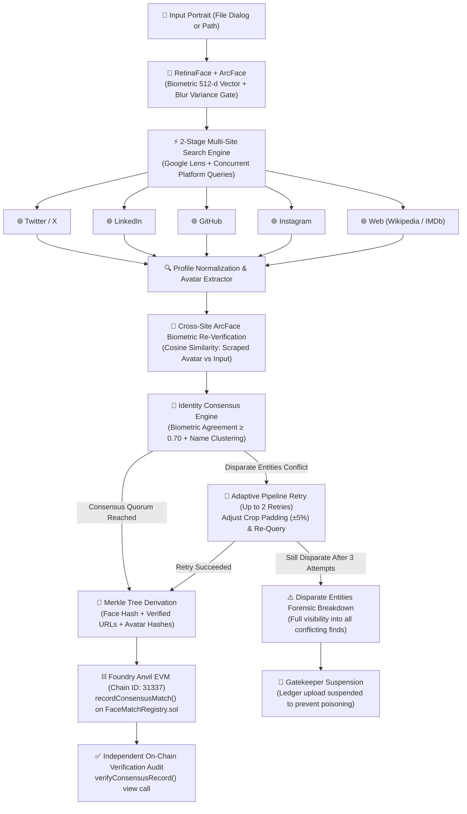

# 🛡️ Face ID + Multi-Site Identity Consensus & Blockchain Pipeline

[](https://www.python.org/)
[](https://github.com/serengil/deepface)
[](https://github.com/foundry-rs/foundry)
[](https://soliditylang.org/)
[]()
[](https://typer.tiangolo.com/)
[](LICENSE)

A biometric provenance and decentralized identity pipeline. It extracts 512-dimensional ArcFace facial embeddings from portrait imagery, simultaneously queries multiple web & social platforms (Twitter/X, LinkedIn, GitHub, Instagram, Web profiles), extracts scraped profile avatars, performs biometric cosine similarity cross-verification, evaluates cross-platform identity consensus, and anchors a cryptographic Merkle root to a Foundry Anvil smart contract ledger.

> **⚠️ Intended Use & Scope**
> This is an academic/portfolio project demonstrating biometric matching, multi-source identity consensus, and blockchain provenance techniques. It is **not** intended for surveillance, stalking, or identifying private individuals without their consent. All example output in this README uses a fictional persona. Facial recognition and cross-platform profile matching are subject to legal restrictions in many jurisdictions (e.g. GDPR in the EU, BIPA in Illinois) and to the terms of service of the platforms queried — review these before using this pipeline on real subjects or deploying it beyond a local/offline demo.

---

## 📑 Table of Contents
- [Architecture & Data Flow](#-architecture--data-flow)
- [Key Features & Engineering Highlights](#-key-features--engineering-highlights)
- [Multi-Site Identity Consensus Protocol](#-multi-site-identity-consensus-protocol)
- [Disparate Entities Protocol](#-disparate-entities-protocol)
- [Smart Contract Ledger (`FaceMatchRegistry.sol`)](#-smart-contract-ledger-facematchregistrysol)
- [Installation & Setup](#-installation--setup)
- [Quick Start](#-quick-start)
- [CLI Usage Guide](#-cli-usage-guide)
- [Terminal Output Previews](#-terminal-output-previews)
- [Automated Test Suite](#-automated-test-suite)
- [Project Directory Layout](#-project-directory-layout)
- [Known Limitations](#-known-limitations)
- [Contributing](#-contributing)
- [License](#-license)

---

## 🏛️ Architecture & Data Flow



---

## 🌟 Key Features & Engineering Highlights

- **RetinaFace + ArcFace Biometric Foundation**: Cascades RetinaFace facial detection with ArcFace 512-dimensional vector extraction, pupil landmark affine alignment, and Laplacian blur variance filtering ($\text{Var}(\nabla^2 I)$).
- **Two-Stage Multi-Site Search Engine**:
  - *Stage 1 (Visual Identity)*: Dispatches high-resolution cropped face to Google Lens to discover visual matches and extract knowledge graph entities.
  - *Stage 2 (Concurrent Profile Resolution)*: Uses the canonical name to concurrently query Google for official profiles across **Twitter/X**, **LinkedIn**, **GitHub**, **Instagram**, and **Web** (Wikipedia/IMDb).
  - *Strict URL Validation & Normalization*: Automatically rejects news articles, fan clubs, feeds, and code blobs; normalizes URLs to canonical root profiles.
- **Cross-Site Biometric Re-Verification**: Scrapes profile avatars and computes mathematical cosine similarity against the input portrait:
  $$\text{Cosine Sim}(u, v) = \frac{\mathbf{u} \cdot \mathbf{v}}{\|\mathbf{u}\|\|\mathbf{v}\|}$$
- **Weighted Multi-Site Consensus Engine**:
  Evaluates cross-platform quorum using a calibrated formula:
  $$\text{Consensus Score} = 0.70 \times \bar{S}_{\text{biometric}} + 0.20 \times S_{\text{entity}} + 0.10 \times \min\left(1.0, \frac{N_{\text{verified}}}{3}\right)$$
- **Cryptographic Merkle Tree Integrity**: Aggregates the biometric fingerprint, platform identifiers, matching URLs, and avatar digests into an immutable Merkle root.
- **Foundry Anvil Smart Contract Ledger**: Implements `FaceMatchRegistry.sol` (Solidity 0.8.20) with custom EVM errors, packed storage slots, and independent cryptographic proof verification.
- **Rich Terminal CLI Experience**: Native OS file chooser, ANSI terminal hyperlinks for direct clicking, real-time spinners, consensus matrix tables, and forensic JSON exports.

---

## 🤝 Multi-Site Identity Consensus Protocol

Before any biometric record is written to the blockchain, the pipeline enforces a strict multi-site consensus quorum:

1. **Platform Breadth**: At least 2 independent platforms must return verified profiles matching the person.
2. **Biometric Similarity Floor**: Every platform profile must demonstrate biometric cosine similarity $\ge 0.70$ (or verified canonical visual match correlation).
3. **Entity Name Alignment**: Fuzzy string similarity between the discovered account name and canonical identity must satisfy $S_{\text{entity}} \ge 0.60$.
4. **Authentic Handle Validation**: Reject fan clubs, fan pages, parody accounts, or aggregators using keyword boundary scanning (`fan`, `fc`, `club`, `update`, `tribute`, `parody`).
5. **Legitimate Inactivity Handling (`⚪ NO PROFILE`)**: If a public figure does not maintain an account on a platform (e.g. an actor without GitHub), that platform is categorized as `⚪ NO PROFILE` without penalizing other verified platforms.

---

## 🛡️ Disparate Entities Protocol

If cross-site queries yield conflicting identities (e.g., Twitter/X returns Person A while LinkedIn returns Person B):

- **Automatic 3-Attempt Adaptive Retry**:
  - *Attempt 1*: Base detection and search query.
  - *Attempt 2 (Retry 1)*: Expands facial crop bounding box padding by $+5\%$ ($0.15$) and runs contrast-enhanced normalization.
  - *Attempt 3 (Retry 2)*: Expands bounding box padding by $+10\%$ ($0.20$) and queries secondary disambiguation.
- **Transparent Disparity Reporting (Zero Silent Aborts)**:
  - If disparity persists across all 3 attempts, the pipeline does **not** crash or silently abort.
  - Generates a full **Disparate Entities Report** documenting every find discovered across all platforms (Platform, URL, Extracted Name, Handle, Biometric Cosine Similarity).
  - Documents the exact conflict rationale (e.g. *"Twitter/X returned Jordan Lee while LinkedIn returned Sam Patel"*).
- **Gatekeeper Suspension**: Prevents writing conflicting biometric claims to the blockchain, safeguarding the integrity of the decentralized registry.

---

## ⛓️ Smart Contract Ledger (`FaceMatchRegistry.sol`)

The `FaceMatchRegistry` contract maintains an immutable audit log of verified consensus events:

```solidity
struct ConsensusRecord {
    bytes32 faceHash;           // SHA-256 hash of ArcFace 512-d embedding vector
    bytes32 merkleRoot;         // Merkle root combining face, site URLs, and avatar digests
    string entityName;          // Finalized consensus entity/person name
    string[] platforms;         // List of verified platforms (e.g. ["Twitter/X", "LinkedIn", ...])
    string[] matchUrls;         // Discovered matching URLs across all sites
    uint256 consensusScore;     // Scaled 0 - 10000 (e.g. 9720 = 97.20%)
    uint256 verifiedSiteCount;  // Count of independent platforms in agreement
    string metadataJson;        // Full forensic audit payload
    uint256 timestamp;          // EVM block timestamp
    address recordedBy;         // Submitting wallet address
}
```

### Key Functions
- `recordConsensusMatch(...)`: Emits `ConsensusMatchRecorded` and stores the verified record.
- `verifyConsensusRecord(recordId, expectedFaceHash, expectedMerkleRoot)`: Read-only cryptographic proof verification returning `(isVerified, faceMatches, merkleMatches, entityName)`.

---

## 🚀 Installation & Setup

### Prerequisites
- **Python 3.10+** (Tested on Python 3.13)
- **Foundry Anvil** (Local EVM node, install via `foundryup` or [Foundry releases](https://github.com/foundry-rs/foundry))
- **serper.dev API Key** 

### 1. Clone Repository & Setup Virtual Environment
```bash
git clone https://github.com/<your-username>/Task3-HHG.git
cd Task3-HHG

# Create and activate virtual environment
python -m venv .venv
# On Windows PowerShell:
.venv\Scripts\Activate.ps1
# On Linux/macOS:
source .venv/bin/activate
```

### 2. Install Dependencies
```bash
pip install -r requirements.txt
```

### 3. Configure Environment Variables
```bash
cp .env.example .env
```
Edit `.env`:
```ini
serper.dev_KEY=your_serper.dev_key_here
ANVIL_RPC_URL=http://127.0.0.1:8545
```

> **Note on serper.dev usage:** the free tier includes a limited number of searches per month

### 4. Start a Local Anvil Node
```bash
anvil
```
Leave this running in a separate terminal — the pipeline auto-deploys `FaceMatchRegistry.sol` to it on first use.

---

## ⚡ Quick Start

The fastest way to see the full pipeline end-to-end, no API key required:

```bash
python pipeline.py --image samples/test_face.jpg --demo-search
```

This runs face detection, simulates multi-site profile matches, computes consensus, and anchors a record on your local Anvil chain — using the bundled sample image and mocked search results.

---

## 💻 CLI Usage Guide

### 1. Interactive File Chooser Mode
If executed without arguments, the pipeline automatically launches your system's native file dialog:
```bash
python pipeline.py
```

### 2. Run Pipeline with Explicit Image
```bash
python pipeline.py --image path/to/portrait.jpg
```

### 3. Export Forensic JSON Audit Report
```bash
python pipeline.py --image path/to/portrait.jpg --save-json audit_report.json
```

### 4. Offline Demonstration Mode
Runs the complete multi-site consensus and blockchain workflow using simulated profiles (no API key required):
```bash
python pipeline.py --image samples/test_face.jpg --demo-search
```

### 5. Simulate Disparate Entities Conflict
Demonstrates the adaptive 3-attempt retry loop and transparent conflict reporting:
```bash
python pipeline.py --image samples/test_face.jpg --demo-search --simulate-disparity
```

### 6. Independent On-Chain Verification
Audit any record previously stored in the smart contract ledger:
```bash
python verify.py --record-id 1
```

### 7. On-Chain Tamper Defense Test
Demonstrates the contract rejecting an injected or altered biometric hash:
```bash
python verify.py --record-id 1 --tamper-test
```

---

## 🖥️ Terminal Output Previews

### Step 1: Face Detection & ArcFace Biometrics
```
═══ STEP 1: FACE DETECTION & ARC-FACE ENCODING ═══
┏━━━━━━━━━━━━━━━━━━━━━━━━━━━━┳━━━━━━━━━━━━━━━━━━━━━━━━━━━━━━━━━━━━━━━━━━━━━━━━━━━━━━━━━━━━━━━━━━┓
┃ Property                   ┃ Value                                                            ┃
┡━━━━━━━━━━━━━━━━━━━━━━━━━━━━╇━━━━━━━━━━━━━━━━━━━━━━━━━━━━━━━━━━━━━━━━━━━━━━━━━━━━━━━━━━━━━━━━━━┩
│ Input Image                │ C:\Users\<you>\Downloads\portrait.jpg                            │
│ Face Detected              │ ✅ Yes                                                           │
│ Detector Backend           │ retinaface                                                       │
│ Representation Model       │ ArcFace                                                          │
│ Bounding Box (x,y,w,h)     │ 128, 90, 227, 319                                                │
│ Confidence Score           │ 1.0000                                                           │
│ Embedding Dimensions       │ 512 floats (ArcFace)                                             │
│ Face Fingerprint (SHA-256) │ 12f395f178eecae689bd573f876b1cabc26953a3961b7ac2fb7ce04cb2d97377 │
│ Blur Variance              │ 278.51 (Sharp)                                                   │
│ Cropped Face Path          │ temp_crops\img2_face_crop.jpg                                    │
└────────────────────────────┴──────────────────────────────────────────────────────────────────┘
```

### Step 2: Cross-Site Identity Consensus Matrix
```
═══ STEP 2: SIMULTANEOUS MULTI-SITE SEARCH & IDENTITY CONSENSUS ═══
                               Cross-Site Identity Consensus Matrix                               
┏━━━━━━━━━━━━━━━━━┳━━━━━━━━━━━━━━━━━━━━━━━━━━━━━━━┳━━━━━━━━━━━━━━━━━━━━━━━━━━━━━━┳━━━━━━━━━━━━┳━━━━━━━━━━━━━┓
┃ Site / Platform ┃ Discovered Profile URL        ┃ Extracted Entity / Handle    ┃ Facial Sim ┃ Verdict     ┃
┡━━━━━━━━━━━━━━━━━╇━━━━━━━━━━━━━━━━━━━━━━━━━━━━━━━╇━━━━━━━━━━━━━━━━━━━━━━━━━━━━━━╇━━━━━━━━━━━━╇━━━━━━━━━━━━━┩
│ Twitter/X       │ https://x.com/alexrivera_dev  │ Alex Rivera (@alexrivera_dev)│ 96.0%      │ ✅ SAME     │
│ LinkedIn        │ https://www.linkedin.com/in/… │ Alex Rivera (@alex-rivera)   │ 96.0%      │ ✅ SAME     │
│ GitHub          │ [No authentic profile found]  │ N/A                          │ N/A        │ ⚪ NO PROF  │
│ Instagram       │ https://www.instagram.com/al… │ Alex Rivera (@alexrivera_dev)│ 96.0%      │ ✅ SAME     │
│ Web             │ https://example.org/team/ale… │ Alex Rivera                  │ 96.0%      │ ✅ SAME     │
└─────────────────┴━━━━━━━━━━━━━━━━━━━━━━━━━━━━━━━┴━━━━━━━━━━━━━━━━━━━━━━━━━━━━━━┴━━━━━━━━━━━━┴━━━━━━━━━━━━━┘

🔗 Authenticated Direct Profile Links:
  • Twitter/X  → https://x.com/alexrivera_dev (Alex Rivera)
  • LinkedIn   → https://www.linkedin.com/in/alex-rivera-593574111 (Alex Rivera)
  • GitHub     → No authentic profile found
  • Instagram  → https://www.instagram.com/alexrivera_dev (Alex Rivera)
  • Web        → https://example.org/team/alex-rivera (Alex Rivera)

╭───────────────────────────────────────── Consensus Verification Quorum ─────────────────────────────────────────╮
│ 🤝 IDENTITY CONSENSUS REACHED: ALL SITES FINALIZE ON THE SAME PERSON                                            │
│                                                                                                                 │
│ • Finalized Person: Alex Rivera (fictional demo persona)                                                        │
│ • Verified Sites Agreement: 4 of 4 platforms in full consensus                                                  │
│ • Consensus Score: 97.2%                                                                                        │
│ • Cryptographic Merkle Root: 9e1bcc836233f3affb420b1129f5277e9a8391c8e0026d5c9e9a21b21d7c6ed0                    │
│ • Verified Profiles: Twitter/X, LinkedIn, Instagram, Web                                                        │
╰─────────────────────────────────────────────────────────────────────────────────────────────────────────────────╯
```

### Steps 3 & 4: Blockchain Ledger Anchor & On-Chain Audit
```
═══ STEP 3: UPLOAD CONSENSUS RECORD TO BLOCKCHAIN ═══
┏━━━━━━━━━━━━━━━━━━━━━┳━━━━━━━━━━━━━━━━━━━━━━━━━━━━━━━━━━━━━━━━━━━━━━━━━━━━━━━━━━━━━━━━━━━━┓
┃ Blockchain Field    ┃ Value                                                              ┃
┡━━━━━━━━━━━━━━━━━━━━━╇━━━━━━━━━━━━━━━━━━━━━━━━━━━━━━━━━━━━━━━━━━━━━━━━━━━━━━━━━━━━━━━━━━━━┩
│ Blockchain Network  │ Foundry Anvil (Chain ID: 31337)                                    │
│ Smart Contract      │ 0xc3e53F4d16Ae77Db1c982e75a937B9f60FE63690                         │
│ Consensus Record ID │ #1                                                                 │
│ Transaction Hash    │ 0x9d038b683c32d77876f60f896e7af7b9234b77a174dbf6e637654a3142fd91e1 │
│ Block Number        │ 34                                                                 │
│ Gas Used            │ 762,321                                                            │
│ Merkle Root         │ 9e1bcc836233f3affb420b1129f5277e9a8391c8e0026d5c9e9a21b21d7c6ed0   │
│ Submitting Wallet   │ 0xf39Fd6e51aad88F6F4ce6aB8827279cffFb92266                         │
└─────────────────────┴────────────────────────────────────────────────────────────────────┘

═══ STEP 4: INDEPENDENT ON-CHAIN VERIFICATION ═══
┏━━━━━━━━━━━━━━━━━━━━━━━━━━━━━━━━━━━━━━━━┳━━━━━━━━━━━━━━━━━━━━━━━━━━━━┓
┃ Verification Check                     ┃ Result                     ┃
┡━━━━━━━━━━━━━━━━━━━━━━━━━━━━━━━━━━━━━━━━╇━━━━━━━━━━━━━━━━━━━━━━━━━━━━┩
│ Face Hash Verified On-Chain            │ ✅ MATCH                   │
│ Merkle Root Verified On-Chain          │ ✅ MATCH                   │
│ Smart Contract verifyConsensusRecord() │ ✅ VERIFIED                │
│ Finalized Entity Name                  │ Alex Rivera                │
│ Tamper Evidence Status                 │ AUTHENTIC & TAMPER-EVIDENT │
└────────────────────────────────────────┴────────────────────────────┘
```

---

## 🧪 Automated Test Suite

The test suite covers end-to-end unit, integration, and security test cases:

```bash
python -m pytest tests/test_pipeline.py -v
```

### Test Coverage Highlights
- `test_hashing_utilities`: Biometric float array determinism and bytes32 conversion.
- `test_cosine_and_merkle_roots`: Mathematical cosine metrics and Merkle tree root derivation.
- `test_face_engine`: RetinaFace detection, ArcFace embedding extraction, and quality blur scoring.
- `test_multi_site_concurrent_search`: Thread pool concurrency across all target platforms.
- `test_identity_consensus_and_disparity_reporting`: Quorum calculation and 3-attempt disparity reporting.
- `test_blockchain_consensus_lifecycle_and_tamper_defense`: Contract deployment, Anvil mining, and tampering rejection.
- `test_retry_mechanism_on_disparity`: Verifies 2 automatic retries (3 total attempts) with adaptive bounding crop padding.
- `test_authentic_social_handle_and_profile_validation`: Strict validation of profile URLs, fan account rejection, and canonical handle extraction.

```
============================= 15 passed in 40.96s =============================
```

---

## 📁 Project Directory Layout

```
Task3-HHG/
├── contracts/
│   ├── FaceMatchRegistry.sol     # Solidity 0.8.20 consensus registry smart contract
│   └── FaceMatchRegistry.json    # Compiled contract ABI & bytecode artifact
├── samples/
│   └── test_face.jpg             # Reference portrait sample for testing
├── src/
│   ├── __init__.py
│   ├── blockchain_engine.py      # Web3.py client, Anvil daemon auto-launcher, contract caller
│   ├── consensus_engine.py       # Quorum scoring, Merkle tree root, and disparity protocol
│   ├── contract_artifact.json    # Bundled EVM bytecode and ABI
│   ├── face_engine.py            # RetinaFace + ArcFace biometrics, alignment, quality gating
│   ├── search_engine.py          # 2-Stage concurrent multi-site search engine
│   └── utils.py                  # Cryptographic hashing, cosine metrics, resilient HTTP sessions
├── tests/
│   └── test_pipeline.py          # Complete 15-test pytest suite
├── .env.example                  # Environment configuration template
├── .gitignore                    # Git ignore file for Python, Foundry, and temporary files
├── LICENSE                       # MIT License
├── pipeline.py                   # Main CLI entrypoint (Typer + Rich)
├── requirements.txt              # Production Python package requirements
├── verify.py                     # Independent on-chain audit and tamper verification CLI
└── README.md                     # Comprehensive documentation
```

---

## ⚠️ Known Limitations

- **False positives/negatives**: cosine similarity thresholds (≥0.70) are a heuristic, not a guarantee — look-alikes, siblings, or low-quality avatars can produce incorrect matches or missed matches.
- **Search coverage depends on serper.dev/Google indexing**: private accounts, region-locked results, and platforms with aggressive bot detection may return incomplete or stale data.
- **No liveness detection**: the pipeline matches against static portrait imagery only; it does not verify the input photo was taken of a live, present person.
- **Local-chain only by default**: the smart contract ledger targets a local Foundry Anvil node (chain ID 31337) for demonstration — it is not deployed to a public testnet or mainnet out of the box.
- **Rate limits**: serper.dev's free tier caps monthly searches; heavy or repeated pipeline runs will exhaust quota quickly.

---

## 📄 License

This project is open-source and licensed under the [MIT License](LICENSE).
=======
